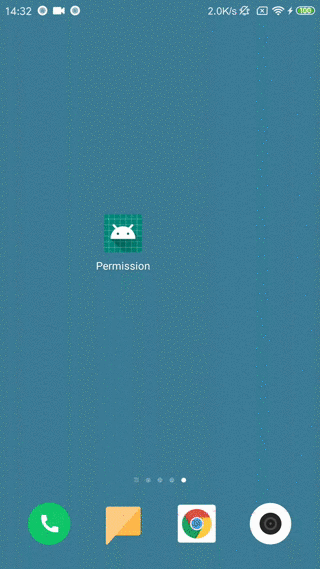

### LiPermission

> 实现方式是基于 [Aspectjx](https://github.com/HujiangTechnology/gradle_plugin_android_aspectjx)，有兴趣的可以去看看。只要一个简单的注解，就可以实现 android 6.0 动态的权限请求。权限库基于 [Andpermission](https://github.com/yanzhenjie/AndPermission)，不过原库不满足自己的需求，基于库上进行了修改。
### 效果图


### 使用方法

##### 1. 在项目根目录的 build.gradle 文件中，添加 `classpath 'com.hujiang.aspectjx:gradle-android-plugin-aspectjx:2.0.4'`

```groovy
dependencies {
        classpath 'com.android.tools.build:gradle:3.4.0'
        classpath 'com.hujiang.aspectjx:gradle-android-plugin-aspectjx:2.0.4'// 添加这句
}
```

##### 2. 在项目文件 build.gradle 文件中，添加 `apply plugin: 'android-aspectjx'`

```groovy
apply plugin: 'com.android.application'
apply plugin: 'android-aspectjx' // 添加这句

android {
    compileSdkVersion 28
    defaultConfig {
			...
    }
}
```

##### 3. 项目文件 build.gradle 文件中，添加 

```java
implementation 'android.leftcoding:permission-annotation:1.0.2'
```

##### 4. 开始使用

申请系统权限，需要事先在`AndroidManifest.xml` 中，进行权限申请

```xml
<manifest xmlns:android="http://schemas.android.com/apk/res/android"
    package="android.permission">
    <uses-permission android:name="android.permission.WRITE_EXTERNAL_STORAGE" />
</manifest>
```


```java
public class SplashActivity extends AppCompatActivity {
    @Override
    protected void onCreate(@Nullable Bundle savedInstanceState) {
        super.onCreate(savedInstanceState);
        setContentView(R.layout.activity_splash);
        findViewById(R.id.start_main).setOnClickListener(new View.OnClickListener() {
            @Override
            public void onClick(View v) {
                checkPermission();
            }
        });
    }

    @PermissionRequest(permissions = {Permissions.WRITE_EXTERNAL_STORAGE})
    private void checkPermission() {
        startActivity(new Intent(this, MainActivity.class));
    }
}
```

### 特殊定制

##### 1. 打开 App 进行授权，否则不进行后面操作

如果想让应用一开始，就进行文件的读写权限请求，授权后再进行后面的操作。例如：

```java
public class SplashActivity extends AppCompatActivity {
    @Override
    protected void onCreate(@Nullable Bundle savedInstanceState) {
        super.onCreate(savedInstanceState);
        setContentView(R.layout.activity_splash);
        checkPermission();
    }

    @PermissionRequest(permissions = {Permissions.WRITE_EXTERNAL_STORAGE}, repeat = true, toFrontRequest = true)
    private void checkPermission() {
        startActivity(new Intent(this, MainActivity.class));
    }
}
```

- `repeat = true` 表示授权失败后，可以再进行权限请求，直到永久被禁止。

- `toFrontRequest = true` 表示权限永久被禁止，跳转权限设置界面，设置权限允许后，返回当前应用，进行再次请求，不过在跳转设置界面，有可能原App界面就已经被系统销毁了，所以，优先考虑，应该去权限设置界面，最好关闭当前app，否则会有其他的意外情况，根据当前手机反应，自由选择。

##### 2. 定制权限被拒绝授权说明，权限拒绝后回调

- 权限被拒绝后，需要合理的理由，你可以定制回调方法。在方法上，添加注解`@PermissionRationale`，如果，不需要知道被拒绝权限，可以不需要添加 `Rationale` 参数
- 如果权限被永久拒绝，想自定义回调方法，在方法上添加注解 `@PermissionCallback` 。

```java
public class MainActivity extends AppCompatActivity {
    Button permission;

    @Override
    protected void onCreate(Bundle savedInstanceState) {
        super.onCreate(savedInstanceState);
        setContentView(R.layout.activity_main);
        permission = findViewById(R.id.permission);
        permission.setOnClickListener(new View.OnClickListener() {
            @Override
            public void onClick(View v) {
                test();
            }
        });
    }

    @Override
    protected void onStart() {
        super.onStart();
    }

    @PermissionRequest(permissions = {Permissions.WRITE_EXTERNAL_STORAGE})
    private void test() {
        Toast.makeText(MainActivity.this, "授权成功", Toast.LENGTH_SHORT).show();
    }

    @PermissionRationale
    private void rationale(final Rationale rationale) {
        new AlertDialog.Builder(MainActivity.this)
                .setMessage("需要以下的权限" + rationale.getPermission() + "请同意授权")
                .setNegativeButton("取消", new DialogInterface.OnClickListener() {
                    @Override
                    public void onClick(DialogInterface dialog, int which) {
                        dialog.dismiss();
                    }
                })
                .setPositiveButton("确定", new DialogInterface.OnClickListener() {
                    @Override
                    public void onClick(DialogInterface dialog, int which) {
                        dialog.dismiss();
                        rationale.onRationale();
                    }
                })
                .show();
    }

    @PermissionCallback
    private void callback() {
        Toast.makeText(this, "授权失败", Toast.LENGTH_SHORT).show();
    }
}
```


##### 有任何问题都可以提 issues